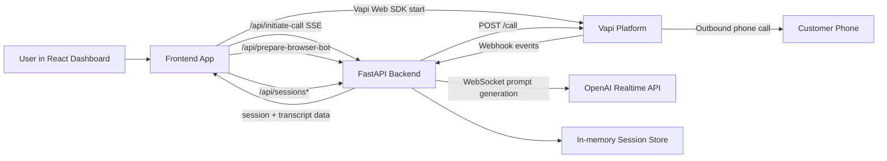
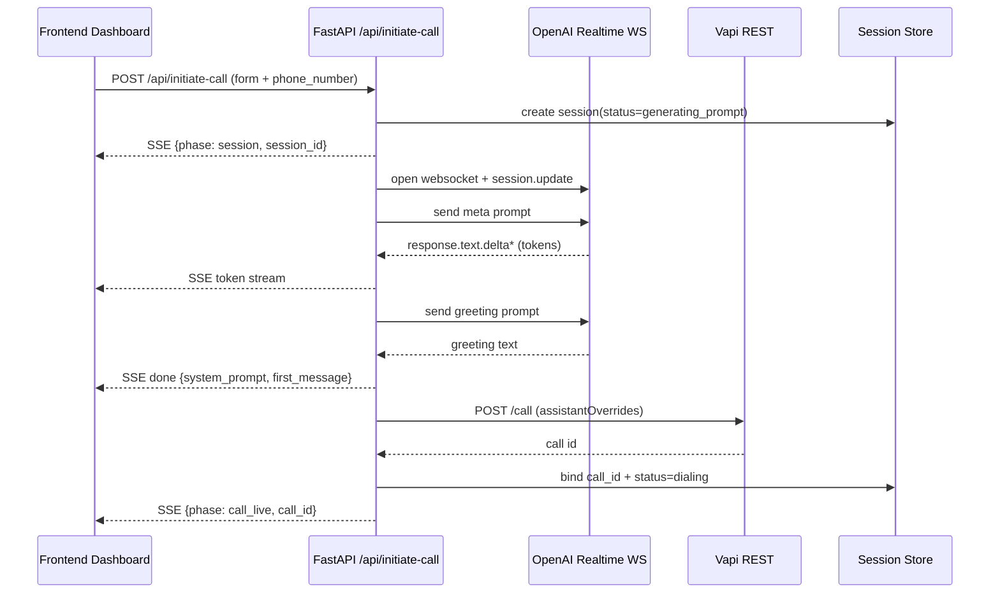
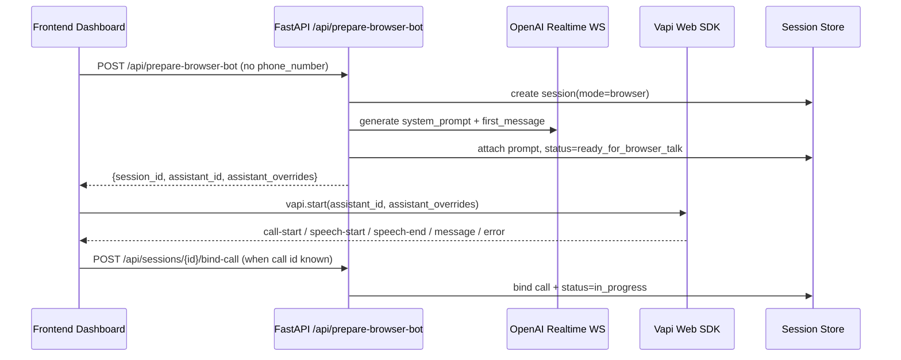

# VoiceForge Project Workflow (Full Guide)

This document explains how this project works in both:
- non-technical language (easy to explain to business/users), and
- technical language (for developers/operators).

---

## 1) Non-Technical Explanation (Plain Language)

### What this product does
This app lets you define a voice bot (industry, company, use case, persona, and guardrails), then interact in two ways:
- **Phone mode**: it calls a real phone number.
- **Browser mode**: you talk to the bot directly in the browser using mic/speaker.

It also has a **Session Logs dashboard** where each run gets a unique session ID so you can inspect status, call ID, and transcripts.

### What happens when you click Start
1. You fill one form in the dashboard.
2. The backend asks OpenAI Realtime to generate the bot brain:
   - a full **system prompt** (how the bot should behave),
   - and a **first message** (opening line).
3. Then:
   - in **Phone mode**, backend tells Vapi to dial the phone number.
   - in **Browser mode**, frontend starts a Vapi web voice session.
4. The app tracks everything under a session ID so you can monitor it in `/sessions`.

### Why there are two modes
- **Phone mode** is for real outbound calling.
- **Browser mode** is for quick testing/demo without placing a phone call.

Both modes use the same bot-definition inputs, so behavior stays aligned.

---

## 2) High-Level Architecture



---

## 3) Technical Component Map

## Backend
- `main.py`
  - Creates FastAPI app.
  - Configures CORS for frontend origin.
  - Mounts API router.
  - Exposes `/health`.

- `config.py`
  - Loads environment via `pydantic-settings`.
  - Defines required keys for OpenAI, Vapi, ElevenLabs, and app settings.

- `call_router.py`
  - Core API endpoints:
    - `POST /api/initiate-call` (phone flow, SSE streaming)
    - `POST /api/prepare-browser-bot` (browser prep flow)
    - `POST /api/webhook/vapi` (event intake)
    - `GET /api/sessions` and `GET /api/sessions/{id}`
    - `POST /api/sessions/{id}/bind-call`
  - Validates and sanitizes request fields.
  - Enforces per-IP in-memory rate limiting.

- `gpt_ws.py`
  - Connects to OpenAI Realtime WebSocket (`wss://api.openai.com/v1/realtime?model=gpt-realtime`).
  - Generates system prompt and greeting with two turns.
  - Streams tokens as SSE chunks.
  - Handles timeout, websocket, DNS, and runtime errors.

- `meta_prompt.py`
  - Builds template text for:
    - system prompt generation (`build_meta_prompt`)
    - greeting generation (`build_greeting_prompt`)

- `vapi_service.py`
  - Builds reusable assistant overrides (`model`, `voice`, `transcriber`, first message).
  - Creates outbound calls via `POST https://api.vapi.ai/call`.
  - Fetches call details via `GET https://api.vapi.ai/call/{id}`.

- `session_store.py`
  - In-memory thread-safe session registry.
  - Tracks session metadata, status, prompt, first message, call ID, transcript events.

- `coding_agent.py`
  - Contains a large prompt string constant.
  - Not used in runtime request flow.

## Frontend (React + Vite)
- `frontend/src/App.tsx`
  - Orchestrates page-level mode state (`phone` / `browser`) and path (`/` vs `/sessions`).
  - Wires all hooks and components.

- Hooks
  - `useCallPipeline.ts`: handles phone SSE pipeline parsing and state timeline.
  - `useBrowserTalk.ts`: handles Vapi Web SDK lifecycle/events for browser voice.
  - `useSessionLogs.ts`: fetches session list/detail with polling.

- Components
  - `CallForm.tsx`: shared form with dual mode controls and dependent dropdown mapping.
  - `PromptStream.tsx`: displays streaming prompt output for phone mode.
  - `BrowserTalkPanel.tsx`: browser talk status + live messages.
  - `StatusPanel.tsx`: generic timeline/error panel.
  - `SessionsDashboard.tsx`: per-session monitoring page.

- `frontend/vite.config.ts`
  - Proxies `/api` and `/health` to backend (`VITE_PROXY_TARGET`, default `http://127.0.0.1:8557`).

---

## 4) End-to-End Workflow (Phone Mode)



### Phone mode API behavior details
- Request model: industry, company, use_case, persona, guardrails, phone_number.
- Field constraints:
  - phone number must match E.164 (`^\+[1-9]\d{7,14}$`).
  - text fields sanitized to strip likely prompt-injection markers (e.g. code fences and braces).
- Stream emits phase/status progress and final call id.

---

## 5) End-to-End Workflow (Browser Mode)



### Browser mode frontend behavior details
- Requires `VITE_VAPI_PUBLIC_KEY`.
- Event handling in `useBrowserTalk`:
  - `call-start` => connected
  - `call-end` => disconnected/reset flags
  - `speech-start` / `speech-end` => speaking indicator
  - `message` => transcript/message timeline
  - `error` => UI error + timeline update

---

## 6) Session Logs Workflow

```mermaid
flowchart TD
  A[Session created in phone/browser flow] --> B[Stored in SessionStore]
  B --> C[GET /api/sessions]
  C --> D[/sessions list UI]
  D --> E[GET /api/sessions/{session_id}]
  E --> F[Session detail UI]
  G[Vapi webhook transcript events] --> B
  H[Vapi call fetch /call/{id}] --> E
```

### How transcripts appear
Two sources are combined (with priority on fetched call messages when available):
1. **Webhook events** (`transcript`, `speech-update`) appended into session store.
2. **On-demand Vapi call fetch** in `GET /api/sessions/{id}` to pull richer message history.

---

## 7) API Surface (Current)

### `POST /api/initiate-call`
- Purpose: phone flow, streamed response.
- Content type: `text/event-stream`.
- Emits token chunks and phase updates, then `call_id`.

### `POST /api/prepare-browser-bot`
- Purpose: browser voice setup.
- Returns:
  - `session_id`
  - `system_prompt`
  - `first_message`
  - `assistant_id`
  - `assistant_overrides`

### `POST /api/sessions/{session_id}/bind-call`
- Purpose: link browser call id back to existing session.

### `GET /api/sessions`
- Purpose: list session summaries.

### `GET /api/sessions/{session_id}`
- Purpose: detailed session view (prompt metadata + transcript/messages).

### `POST /api/webhook/vapi`
- Purpose: receives Vapi lifecycle/transcript events and updates session status/transcript.

---

## 8) Session Status Lifecycle

Typical statuses used by backend:
- `generating_prompt`
- `prompt_ready`
- `dialing`
- `ready_for_browser_talk`
- `in_progress`
- `ended`
- `failed`

Transitions depend on route and webhook events.

---

## 9) Environment Variables

## Backend (`.env`)
- `OPENAI_API_KEY`: used for Realtime WS auth.
- `VAPI_API_KEY`: used for Vapi REST calls.
- `VAPI_PHONE_NUMBER_ID`: Vapi outbound caller id.
- `VAPI_ASSISTANT_ID`: assistant reference for both phone and browser prep.
- `ELEVENLABS_VOICE_ID`: injected into voice config.
- `APP_ENV`, `LOG_LEVEL`, `FRONTEND_ORIGIN`, `RATE_LIMIT_PER_MINUTE`.

## Frontend (`frontend/.env`)
- `VITE_PROXY_TARGET`: backend target for local Vite proxy.
- `VITE_API_BASE_URL`: optional direct base URL override.
- `VITE_VAPI_PUBLIC_KEY`: required for browser voice mode.

---

## 10) Industry / Use Case Mapping in UI

`CallForm.tsx` uses dependent dropdowns:
- BFSI -> Pre-Dues Collection, Lead Qualification, Wealth Management, Welcome Call, Post Dues, CX
- Real Estate -> Pre-Sales
- Retail -> Feedback
- Tech -> Customer Experience
- Human Resource -> Business Partner
- Manufacturing -> Safety Agent
- Venture Capital -> Event Co-ordinator
- Welfare -> Survey Agent

When Industry changes, Use Case auto-resets to that industry's first option.

---

## 11) Error & Failure Paths

Common classes handled in code:
- **Rate limit**: `429` from `_enforce_rate_limit`.
- **Validation errors**: Pydantic model constraints and phone format.
- **OpenAI Realtime**:
  - DNS failures (`socket.gaierror`)
  - WS disconnects (`ConnectionClosed`, `WebSocketException`)
  - stream/generation timeout
  - explicit Realtime error events
- **Vapi REST**:
  - non-2xx response (`HTTPStatusError`)
  - connectivity issues (`RequestError`)
- **Browser mode**:
  - missing `VITE_VAPI_PUBLIC_KEY`
  - mic permissions/network/session errors surfaced through SDK events.

---

## 12) Security & Operational Notes

Current safeguards implemented:
- Input validation and sanitization on generation fields.
- Per-IP in-memory rate limit for generation routes.
- CORS configured for frontend origin and localhost/127.0.0.1 variant.
- Phone number masking in logs.

Current operational limits:
- Session store is in-memory only (resets on backend restart).
- No DB persistence yet for long-term transcript retention.

---

## 13) Quick Mental Model

If you need one sentence:

> The app is a dual-mode voice-agent launcher: it generates a dynamic assistant prompt with OpenAI Realtime, then either places a Vapi outbound phone call or starts a Vapi browser voice session, while tracking every run by session ID for monitoring in `/sessions`.

